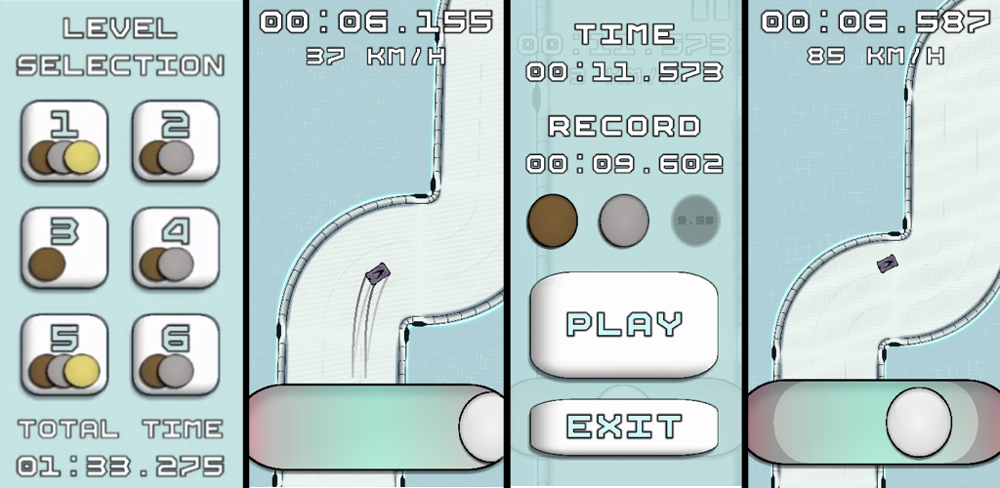

<h1>
  
  Gamax Track
  
</h1>

Gamax is a skill-based 2D racing mobile game Built with **Unity** and **C#**.

📥 **Download it now from the links below:**

**Android:** [Google Play Store → Gamax Track](https://play.google.com/store/apps/details?id=com.MaxHence.Gamax)  
**iOS:** *coming soon*

## 🏎️ Game Concept
**Easy to play, hard to master !**

Inspired by *Trackmania*, this game is all about **player skill** and going for the fastest times. It has smooth controls, precise handling, and is based on a **speedrunning** mechanic.
But in the same time it is also super **easy to pick up**, since you only need **one finger to play**.

  

### 🕹️ Control Scheme
- The player controls the car by **sliding their finger** on a **touchpad** at the bottom of the screen.  
- Moving the finger toward the **edges of the pad** makes the car **turn more sharply**, but also **reduces speed**.  
- Keeping the finger in the **center** allows the car to **accelerate straight ahead**.

### 💨 Sliding Mechanic
- When the player’s finger moves **past a sliding threshold** (indicated by darker zones on the pad),  
  the car **enters a slide**, losing steering control and slowing down until the finger returns within bounds.

### ⚙️ Dynamic Sliding Threshold
- The **sliding threshold dynamically adjusts** based on the car’s speed.  
- At **higher speeds**, the threshold **moves closer to the center**, making the car harder to control and rewarding precision.

---

## 🏁⏱️Goal
Reach the **finish line** as fast as possible using only your driving skills — no luck, no upgrades, just pure control.
Try to **set the fastest times** possible on each **map** to collect all the **medals 🥇🥈🥉**

---

## 📄 Intellectual Property

For detailed information about the development process, please refer to the document:  
`Mobile_game_app_development.pdf`

If you have any questions regarding the game, I am available to provide answers.  

All rights reserved © Max Henrotin

